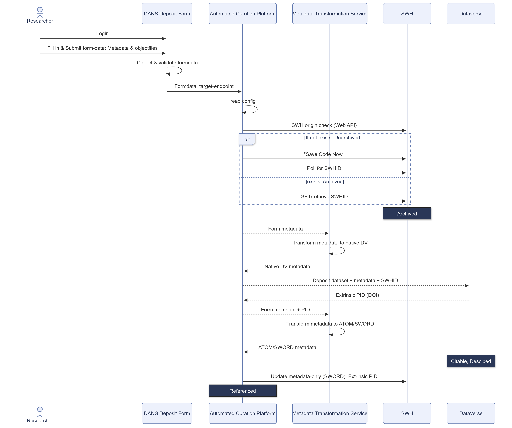

DANS Deposit Form for developers
========================================
!!! note "Living Document (WIP), 21 December 2023"

    This work is carried out in the context of the [FC4E project]{target="_blank"} (Data Infrastructure Capacities for EOSC), funded by the EU's Horizon 2020 project call HORIZON-INFRA-2021-EOSC-01.  
    It is developed by Task 6.1: "API and Connectors Between Scholarly Repositories and Software Heritage", as part of the working package 6 (WP6): "Services and tools to archive, reference, describe and cite research software".

### Sequence Diagram

[FC4E project]: {{ hyperlink.ext.fc4e }}
[Dans Deposit]: {{ hyperlink.ext.ddeposit }}